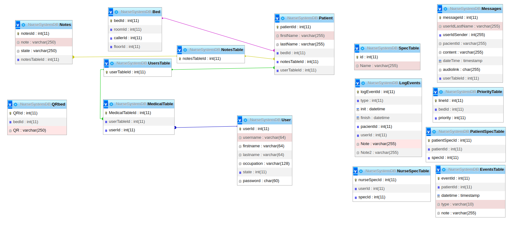

# ServerNurse
Server for Nurse Messaging System based in MQTT
<br>
## System Description
This server is part of a system that includes a mobile messaging application, a MQTT broker and a administration web page. 
<br>
<br>


<br>

## Database Description
<br>
The system uses a MySQL Relational database for storing patients and users information, event logs, and beds information. The database diagrams is:

<br>


<br>

The system needs to precharge a demo database, after clonning the repository extract the demo-database file in the directory "./db". \
The demo-database file can be download from: 
https://drive.google.com/file/d/1eWSW7uG1hFr87aKrVnCOLjj4MOsV8Xzu/view?usp=sharing. 

Instruction:
```
cd db
sudo tar xvfj <filepath>
```

## How to run NodeJs application 

In order to run the application, after the database is extracted, the user must create a environment file "./.env" with the following content:
``` 
##SECURITY
#secret pass must be correlated with the front page
JWT_SECRET = 'holamundo';
#token expiration time
JWT_EXP_TIM = 7d

##MQTT CONFIGURATION
##setting por for using websockets(ip and port must 
##be the same in the mobile clients and the front page)
MQTT_CONNECTION = 'ws://192.168.1.100:9001'

##server
PORT_LOCAL    = 3000

##timezone

TZ = America/Argentina/Buenos_Aires 
```

As the system uses calendar events, the timezone must be set to America/Argentina/Buenos_Aires.

After all these steps, run:
```
docker-compose up
```
or (if you want to run it on the background):
```
docker-compose up -d
```
<br>

In order to stop the container execution:
```
docker-compose down
```
<br>

## How to run some test on the application
<br>

The test provided is a partial test, some features are not tested. The system must have installed postman, newman and newman-reporter-htmlextra:

```
snap install postman
``` 

```
npm i -g newman
npm i -g newman-reporter-htmlextra
``` 

With the application running in background or in another window, open a new window and in the directory ServerNurse run:
```
cd Testing
cd postman-collections
newman run ./logueo_usuario.postman_collection.json −r cli,htmlextra
```
The report will be displayed in the console and the html stored in "./Testing/postman-collections/newman".

There are other tests inside the directory "Testing/postman-collections".

### NodeJs application description 

<br>
The system publishes information of the beds status in a topic "/Beds/status" every 1:30 seconds and the user status in "/User/status" every 1 seconds (see file "./src/backend/mqtt.js"). <br>
It also interacts with the administration page (https://github.com/gustavobastian/AdminPageNurse) , with the mobile application (https://github.com/gustavobastian/ClientNurse) and the bed caller (https://github.com/gustavobastian/BedCaller).


There are two kinds of clients for this applications:
<ul>
<li> HTTP clients are served by the express submodule and its routes. The subsystem endpoints are stored in the directory "./src/backend/routes"</li>
<li> MQTT clients can interact with the system with a specified protocol. The subsystem modules are stored in the directory "./src/backend/mqtt"
</li>
</ul>

<br>

## HTTP Endpoints specification (under construction)
### Beds Management

GET methods:
* "localhost:8000/api/beds/" : returns a list of all the beds avaiable in the system in a Json format:\
`
[{"bedId":1,"roomId":1,"callerId":1,"floorId":0},{"bedId":2,"roomId":1,"callerId":2,"floorId":0},{"bedId":3,"roomId":1,"callerId":1,"floorId":0 
}]`

* "localhost:8000/api/beds/:id" : returns the information of a bed a Json format: 
`[{"bedId":1,"roomId":1,"callerId":1,"floorId":0}]`

PUT methods:\
In order to edit a bed information
* "localhost:8000/api/beds/:id" : needs the body to have the new information in a Json format. The bedId is passed as parameter. Example of body:
`[{"roomId":1,"callerId":1,"floorId":0}]`

POST method:\
Adding a new bed. the bedId is created by the system in a incremental way.
* "localhost:8000/api/beds/" : needs the body to have information in a Json format. The bedId is passed as parameter. Example of body:
`[{"roomId":1,"callerId":1,"floorId":0}]` 

DELETE method:
* "localhost:8000/api/beds/:id": needs bedId as parameter. Returns the sql result or the error.

### Users Management

GET methods:
* "localhost:8000/api/user/": returns all the users registered in the system in JSON format.
* "localhost:8000/api/user/:id": returns the user's information registered in the system in JSON format. Example: 
`[{"userId":1,"username":"Josesito","firstname":"Jose","lastname":"laurm","occupation":"administrador","state":1,"password":"1234"}]` 

POST methods:
* "localhost:8000/api/user/": used for adding a new user to the system, needs users information in the body parameter.
Body example:  
{"username":"peter",
 "firstname":"peter",
 "lastname":"Frant",
 "occupation":"medico",
 "state":"1",
 "password":"123456"}

PUT methods:
* "localhost:8000/api/user/:id": used for editing a user information: needs information passed by the body parameter in JSON format.
Example:   
 {
  "username":"peter",
  "firstname":"peter",
  "lastname":"Frant",
  "occupation":"medico",
  "state":"1",
  "password":"123456"}


DELETE method:
* "localhost:8000/api/user/:id": used for removing a user information from the database.

### Authentication 
POST methods:
* "localhost:8000/api/authentication/": this method ask the server for a jwt-token in order to access the endpoints of the system.  The body parameter must have:\
[{
  "username":"peter",  
  "password":"123456"}]

GET methods:
* "localhost:8000/api/authentication/logout/": this method logout the user(not used right now... used with cookies in previous versions).

### Table of treatments
This table contains all the nurse spec that can be assigned to one patient.  A nurse can have more than one, but a patient only one. It is used to filter the beds that can attend a nurse.

GET methods:
* "localhost:8000/api/specTable/all": this method returns all information in the table of treatments in JSON format. Example:\
[{"id":1,"Name":"Oncología"},
{"id":2,"Name":"Cardiología"},
{"id":3,"Name":"Podología"},
{"id":4,"Name":"Odontología"},
{"id":5,"Name":"Vacunación"},
{"id":6,"Name":"General"}]

* "localhost:8000/api/specTable/:id": this method returns the name of a single spec:\
  [{"name":"Oncología"}]

POST methods:
* "localhost:8000/api/specTable/": this method is used to add a new treatment/spec to the table. The body must have: \
[{Spec: "Enfermeria de salud mental"}]


DELETE methods:
* "localhost:8000/api/specTable/:id": this method delete a single specification.

### Table of treatments assigned to a nurse
Based in previous table, one can assign multiple specializations to a nurse by using this table. The methods are:

GET methods:

* "localhost:8000/api/nurseSpecTable/": this method is used to return the specialization of the entire group of nurses.\
[{"nurseSpecId":1,"userId":8,"specId":2},\
{"nurseSpecId":2,"userId":8,"specId":1},\
{"nurseSpecId":3,"userId":9,"specId":1}]

* "localhost:8000/api/nurseSpecTable/:id": this method is used to retrieve all the specialization of a single user. the id parameter is the userId. An example of the response body is:\
[{"nurseSpecId":1,"Name":"Cardiología","specId":2},\
{"nurseSpecId":2,"Name":"Oncología","specId":1}]

POST methods:
* "localhost:8000/api/nurseSpecTable/": this method is used to create a new specialization for a nurse. The body format has the form:\
 [{ specId: 1,  userId:}]\
 where the specId is specialization id from previous table, and the userId is the identification of user.

DELETE methods: 
* "localhost:8000/api/nurseSpecTable/:id": this method is used to delete a row in the table(removing a nurse specialization). The id parameter is the row index.


### Patient Management
GET methods:
* "localhost:8000/api/patient/": returns all the patients registered in the system in JSON format.
* "localhost:8000/api/patient/:id": returns the user's information registered in the system in JSON format. Example: \
`[{"patientId":1,"firstName":"Pedro","lastName":"Pasculli","bedId":1,"notesTableId":1,"userTableId":1}]` 

POST methods:
* "localhost:8000/api/patient/": used for adding a new pacient to the system, needs the patient information in the body of the message.
Body example:  
 {"patientId":2, 
  "firstname":"peter",
  "lastname":"Frant",
  "bedId":"3",
  "notesTableId":"1",
  "userTableId":"1"}
PUT methods:
* "localhost:8000/api/patient/:id": used for editing a patient information: needs information passed by the body parameter in JSON format.
Example:   
 [{"firstname":"peter",
  "lastname":"Frant",
  "bedId":"3",
  "notesTableId":"1",
  "userTableId":"1"}]


DELETE method:
* "localhost:8000/api/patient/:id": used for removing a user information from the database.

#### Table of treatments assigned to a patient
GET methods:
* "localhost:8000/api/patient/treatment/all": returns the pacient-treatment table in JSON Format:\
[{"pacientSpecId":1,"patientId":1,"specId":1,"id":1,"Name":"Oncología"},{"pacientSpecId":2,"patientId":2,"specId":2,"id":2,"Name":"Cardiología"}]

* "localhost:8000/api/patient/treatment/:id": returns the pacient-treatment row in JSON Format:\
[{"pacientSpecId":1,"patientId":1,"specId":1,"id":1,"Name":"Oncología"}]

* "localhost:8000/api/patient/treatment/bed/:id": returns the specialization Id in JSON Format using the bedId as parameter:\
[{"bedId":1,"specId":1}]\
Special note: this version of software only supports one treatment for each pacient


POST method:
* "localhost:8000/api/patient/treatment/": generate a new row in the table.

### Messaging Management
GET methods:
* "localhost:8000/api/messages/": returns the last 100 messages saved in the database in JSON format.
Example of return:\
[{"messageId":1,"userIdLastName":"1","userIdSender":1,"patientId":"1","content":"Se levanto bien","dateTime":"2022-05-01T23:36:03.000Z","audiolink":null,"userTableId":1}]
* "localhost:8000/api/messages/info": returns the last 100 messages saved in the database in JSON format with information of the sender.
Example of return:\
[{"messageId":1,"firstname":"Jose","lastname":"laurm","patientId":"1","content":"Se levanto bien"}]


This work is based in https://github.com/gotoiot/app-fullstack-base
by Agustin Bassi https://github.com/agustinBassi ,Ernesto Gigliotti https://github.com/ernesto-g and Brian Ducca https://github.com/brianducca
